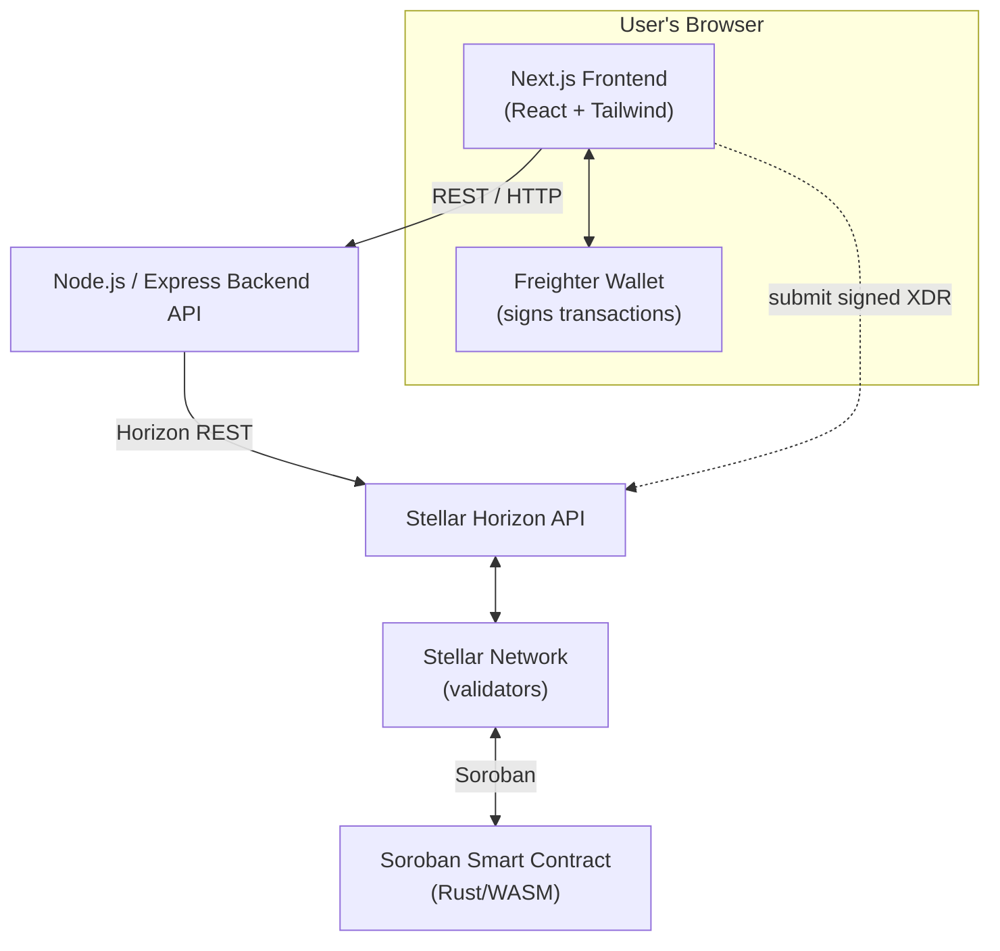

# Stellar-MicroPay: Streaming Payment Channels using Soroban

## Overview

This project implements a Soroban smart contract for streaming payment channels on the Stellar network. The contract allows a payer to deposit XLM and stream it to a recipient at a defined rate (e.g., 1 XLM per hour). The recipient can claim the streamed amount at any time.

For an introduction to Stellar and Soroban terminology (such as stroops, ledgers, XDR, Freighter, and Turrets), consult the [Stellar & Soroban Glossary](GLOSSARY.md).

## Features

- **Stream Creation**: Open payment streams with custom rates and deposits
- **Claim Payments**: Recipients can claim available funds at any time
- **Top-up Streams**: Add more funds to existing streams
- **Close Streams**: Payers can close streams and receive refunds for unstreamed portions
- **Rate-based Streaming**: Payments are calculated based on ledger progression

## Architecture

Stellar-MicroPay is a three-tier Web3 application. The diagram below shows how the
pieces fit together, from the browser down to the Soroban contract on the Stellar
network. A more detailed breakdown lives in [`docs/architecture.md`](docs/architecture.md).



## Contract Structure

### Stream Struct

```rust
pub struct Stream {
    pub payer: Address,           // Address of the payer
    pub recipient: Address,       // Address of the recipient
    pub rate_per_ledger: i128,    // Amount streamed per ledger (in stroops)
    pub deposited: i128,          // Total amount deposited (in stroops)
    pub claimed: i128,            // Total amount claimed (in stroops)
    pub start_ledger: u32,        // Ledger number when stream started
    pub token: Address,           // Token escrowed at open time
}
```

### Core Functions

#### `open_stream(payer, recipient, rate_per_ledger, deposit) -> u32`
- Creates a new payment stream
- Returns the stream ID
- Transfers initial deposit from payer to contract

#### `claim_stream(stream_id, recipient) -> i128`
- Claims all unclaimed streamed XLM up to current ledger
- Only the designated recipient can claim
- Returns the amount claimed

#### `top_up_stream(stream_id, payer, amount)`
- Adds more funds to an existing stream
- Only the original payer can top up
- Extends the stream duration

#### `close_stream(stream_id, payer) -> i128`
- Stops the stream and refunds unstreamed portion
- Only the original payer can close
- Returns the refund amount

#### `get_stream(stream_id) -> Stream`
- Returns stream information for querying

#### `get_claimable(stream_id) -> i128`
- Calculates claimable amount without claiming

#### `get_stream_history(stream_id) -> Vec<StreamEvent>`
- Returns the full append-only event log for a stream
- Each entry records the `event_type` (`claim` / `topup` / `close`), the
  `amount`, and the `ledger` it happened on

#### `get_stream_count() -> u32`
- Returns the number of streams ever opened

## Administration

#### `set_max_rate(admin, max_rate)`
- Sets an admin-configurable cap on `rate_per_ledger` for new streams
- `open_stream` rejects any rate above the cap with `ContractError::RateTooHigh`
- A cap of `0` (the default) disables the cap entirely
- Lowering the cap does not affect streams that already exist

#### `get_max_rate() -> i128`
- Returns the current cap (`0` means uncapped)

#### `freeze(admin)` / `unfreeze(admin)`
- `freeze` sets a `Frozen` flag that blocks every state-changing entry point
  with `ContractError::Frozen`
- `unfreeze` clears it
- Read-only getters (`get_stream`, `get_claimable`, `get_stream_history`,
  `is_frozen`, …) keep working while frozen, so monitoring and incident
  response are not blinded by a freeze

#### `is_frozen() -> bool`
- Whether the contract is currently frozen

## Security Features

- **Authorization**: Only recipients can claim, only payers can close/top-up
- **Rate Validation**: Rates must be positive and within the admin cap
- **Deposit Validation**: Deposits must be positive
- **Overflow Protection**: Saturating arithmetic; accrual is capped at the
  funded window so `total_streamed <= deposited` holds structurally
- **Emergency Pause**: Admin can freeze all state changes without a redeploy
- **Access Control**: Proper authentication checks for all operations

## Mathematical Calculations

### Claimable Amount Calculation
```
elapsed_ledgers = current_ledger - start_ledger // ledgers elapsed since start
total_streamed = rate_per_ledger * elapsed_ledgers // amount accrued to date
claimable = total_streamed - claimed // accrued funds not yet claimed
actual_claim = min(claimable, deposited - claimed) // cap at funds still deposited
```
With zero elapsed ledgers, nothing new is claimable. Once the deposit is exhausted,
the remaining-deposit cap keeps further claims at zero.

Capping `elapsed_ledgers` at `funded_ledgers` before the multiply is what makes
the arithmetic total: the product is bounded by `deposited`, so it can neither
overflow `i128` nor exceed the escrow, for any combination of inputs.

### Refund Calculation
```
elapsed_ledgers = current_ledger - start_ledger // ledgers elapsed since start
total_streamed = rate_per_ledger * elapsed_ledgers // amount accrued to date
refundable = deposited - max(total_streamed, claimed) // funds neither streamed nor claimed
```
With zero elapsed ledgers and no prior claims, the full deposit is refundable.
When the stream is exhausted, the maximum reaches the deposit and the refund is zero.

Claims and refunds split the deposit exactly: `claimed + refundable == deposited`
for any claim schedule, which `test_close_stream_after_claims` and
`fuzz_repeated_claims_never_exceed_deposit` both assert.

## Usage Examples

### Opening a Stream
```rust
let stream_id = StellarMicroPay::open_stream(
    &env,
    payer_address,
    recipient_address,
    1000,                    // 0.00001 XLM per ledger
    1000000                  // 0.01 XLM deposit
);
```

### Claiming Funds
```rust
let claimed = StellarMicroPay::claim_stream(
    &env,
    stream_id,
    recipient_address
);
```

### Topping Up a Stream
```rust
StellarMicroPay::top_up_stream(
    &env,
    stream_id,
    payer_address,
    500000                   // Additional 0.005 XLM
);
```

### Closing a Stream
```rust
let refund = StellarMicroPay::close_stream(
    &env,
    stream_id,
    payer_address
);
```

## Testing

The contract includes comprehensive tests covering:
- Stream creation and basic operations
- Claim calculations at various ledger offsets
- Multiple claims over time
- Deposit limits and overflow handling
- Top-up functionality
- Close and refund calculations
- Authorization and validation
- Error conditions
- Rate cap at, below, and above the configured maximum
- Stream event log contents and ordering
- Frozen and unfrozen behavior across every entry point

Run everything with `cargo test`, or just the property tests with:

```bash
cargo test fuzz -- --nocapture
```

The property tests replay saved counterexamples from
`contracts/stellar-micropay-contract/proptest-regressions/lib.txt` before
generating new cases, so a bug found once stays covered.

The wasm build is not exercised by `cargo test`; it requires stellar-cli
v25.2.0+ (`stellar contract build`). CI runs the same check.

## Installation and Deployment

### Docker

You can run the pre-built images from GitHub Container Registry:

```bash
docker pull ghcr.io/emmy123222/stellar-micropay-backend:latest
docker pull ghcr.io/emmy123222/stellar-micropay-frontend:latest
```

### Manual Setup

1. Install Rust and Soroban SDK
2. Clone this repository
3. Build the contract: `stellar contract build` (soroban-sdk 28 requires
   stellar-cli v25.2.0+ for the wasm build)
4. Deploy to Stellar testnet/mainnet
5. Initialize contract with required parameters

## Acceptance Criteria Met

✅ **`cargo test` passes for all streaming tests** (36 tests)
✅ **Claim amount calculated correctly at any ledger offset**
✅ **Top-up increases the stream duration**
✅ **Close refunds the correct unclaimed amount** — `claimed + refund == deposited`
✅ **Only the recipient can claim, only the payer can close**
✅ **Admin-configurable rate cap** — `set_max_rate`, `0` disables it
✅ **No arithmetic panic for arbitrary inputs** — proptest over 1000 random
   `(rate, elapsed, deposit, claimed)` tuples
✅ **Full claim/top-up history** — `get_stream_history` returns the event log
✅ **Emergency pause** — `freeze` / `unfreeze`, read-only getters stay available

## Technical Details

- **Contract Size**: Optimized for minimal deployment costs
- **Gas Efficiency**: Efficient storage and computation patterns
- **Security**: Comprehensive input validation and access controls
- **Compliance**: Follows Soroban best practices and standards

## Documentation

- [📖 Stellar & Soroban Glossary](GLOSSARY.md) — Plain-English guide to Stellar and Soroban terminology (XLM, stroops, ledgers, sequence numbers, Horizon, Soroban, XDR, Freighter, SEP-0007, SEP-0010, trustlines, federation, and turrets).
- [🤝 Contributing Guide](CONTRIBUTING.md) — Guidelines for contributing and setting up the development environment.
- [🚀 Deployment Guide](DEPLOYMENT_GUIDE.md) — Instructions for deploying to production.
- [📚 Technical Architecture & Docs](docs/) — Detailed documentation on architecture, Ledger hardware wallet support, Turrets, analytics, and APIs.
## Contributors

Thanks to everyone who has contributed to Stellar-MicroPay! 🎉

<a href="https://github.com/Emmy123222/Stellar-MicroPay/graphs/contributors">
  
</a>

The contributor graph above is rendered by the [`contributors-img`](https://contributors-img.web.app)
service (the maintained successor to the `contributors-img` GitHub Action). Each name below links
to its GitHub profile.

### Thanks to

- [@Emmy123222](https://github.com/Emmy123222)
- [@emmanuel](https://github.com/emmanuel)
- [@iamTissan](https://github.com/iamTissan)
- [@zeemscript](https://github.com/zeemscript)
- [@Ennyhorla1](https://github.com/Ennyhorla1)
- [@Seunfunmi-319509](https://github.com/Seunfunmi-319509)
- [@AGWAM001](https://github.com/AGWAM001)
- [@johnsmccain](https://github.com/johnsmccain)
- [@alabiopeyemi](https://github.com/alabiopeyemi)
- [@Hollujay](https://github.com/Hollujay)
- [@Gojv-byte](https://github.com/Gojv-byte)
- [@Manuelshub](https://github.com/Manuelshub)
- [@Cjay-Cyber-2](https://github.com/Cjay-Cyber-2)
- [@Nanle-code](https://github.com/Nanle-code)
- [@Robinsonchiziterem](https://github.com/Robinsonchiziterem)
- [@gboigwe](https://github.com/gboigwe)
- [@devfoma](https://github.com/devfoma)
- [@nonso7](https://github.com/nonso7)
- [@Emelie-Dev](https://github.com/Emelie-Dev)
- [@harystyleseze](https://github.com/harystyleseze)

...and [all the other contributors](https://github.com/Emmy123222/Stellar-MicroPay/graphs/contributors)
who have helped shape this project.

## License

This project is open source and available under the MIT License.
